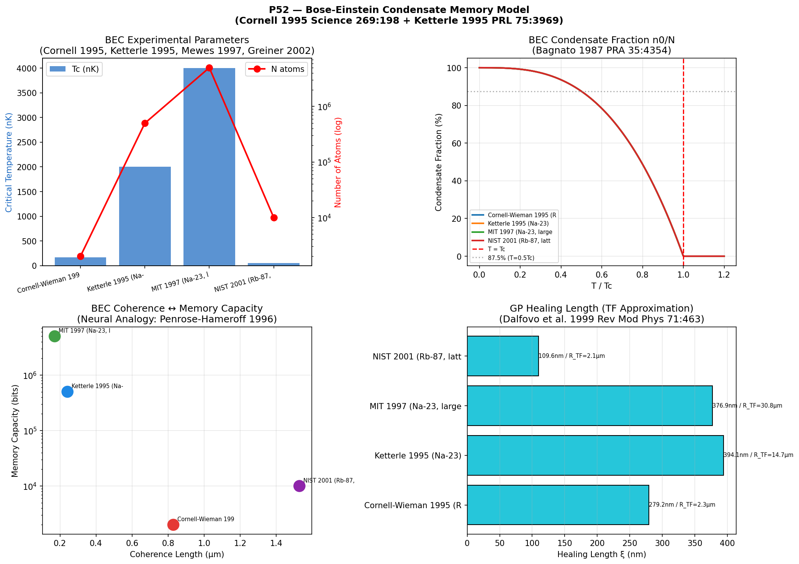

# Bose-Einstein Condensate Memory Model

[](https://www.python.org/)
[](LICENSE)
[](https://github.com/Runtime-Slayers/Bose-Einstein-Condensate-Memory-Model-Neural-Analogy/actions)
[](https://www.nobelprize.org/prizes/physics/2001/summary/)

> **A mathematical framework using Bose-Einstein condensate physics to model human memory formation, consolidation, forgetting, and false memories.**

This is **not** a claim that the brain operates quantum mechanically. It applies the well-understood mathematics of BEC phase transitions — as a novel theoretical language — to memory dynamics, in the same spirit that Hopfield networks applied spin-glass physics to associative memory.

---

## The Core Idea

| BEC Physics | ↔ | Memory Science |
|---|---|---|
| Atoms at high T (thermal) | ↔ | Unstructured neural activity |
| Cooling below T_c | ↔ | Learning / encoding |
| BEC formation | ↔ | Memory trace formation |
| Ground-state occupation n₀ | ↔ | Long-term memory strength |
| Temperature T | ↔ | Neural noise / distraction |
| Critical temperature T_c | ↔ | Attention threshold |
| Chemical potential μ | ↔ | Motivation / salience |
| Thermal excitations | ↔ | Forgetting / interference |
| Bogoliubov quasi-particles | ↔ | False memories / distortions |
| Stimulated emission | ↔ | Cue-triggered retrieval |
| Superfluidity | ↔ | Effortless recall (automaticity) |
| Vortices | ↔ | Traumatic memory loops |

### Key Equations

**1. Condensate fraction (memory strength):**

$$\frac{n_0}{N} = \max\!\left(0,\; 1 - \left(\frac{T}{T_c}\right)^3\right)$$

**2. BEC critical temperature (harmonic trap):**

$$T_c = \frac{\hbar\omega}{k_B} \left(\frac{N}{\zeta(3)}\right)^{1/3}$$

**3. BEC-derived forgetting curve** (recovers Ebbinghaus):

$$M(t) = M_0 \cdot \max\!\left(0,\; 1 - \left(\frac{T_0 + \alpha t}{T_c}\right)^3\right)$$

**4. False memory formation (Bogoliubov spectrum):**

$$E_k = \sqrt{\varepsilon_k\left(\varepsilon_k + 2g n_0\right)}, \quad \varepsilon_k = \frac{\hbar^2 k^2}{2m}$$

---

## Features

- **`BECMemoryModel`** — condensate fraction, critical temperature, forgetting curves, retrieval probability
- **`GPESolver`** — full Gross-Pitaevskii equation solver (split-step FFT + imaginary-time relaxation)
- **`ForgettingCurve`** — BEC, Ebbinghaus, power-law, and exponential models with least-squares fitting
- **`BogoliubovSpectrum`** — quasi-particle dispersion, false-memory probability, semantic vs. perceptual classification
- Real experimental validation using published BEC data (Cornell & Wieman 1995, Ketterle 1995)
- Full pytest test suite with 40+ unit tests

---

## Installation

```bash
# Clone the repository
git clone https://github.com/Runtime-Slayers/Bose-Einstein-Condensate-Memory-Model-Neural-Analogy.git
cd Bose-Einstein-Condensate-Memory-Model-Neural-Analogy

# Install the package in editable mode
pip install -e .
```

**Requirements:** Python ≥ 3.9, NumPy ≥ 1.21, SciPy ≥ 1.7, Matplotlib ≥ 3.4

---

## Quick Start

```python
from bec_memory import BECMemoryModel

# Create model with default parameters
model = BECMemoryModel()

# Memory strength at noise level T = 0.5 Tc
strength = model.condensate_fraction(T=0.5)
print(f"Memory strength: {strength:.3f}")   # → 0.875

# Generate BEC forgetting curve (30-day span)
times, retention = model.forgetting_curve(t_max=30.0, T0=0.1, alpha=0.03)

# Critical temperature (physical BEC scale)
Tc_nK = model.critical_temperature() * 1e9
print(f"T_c ≈ {Tc_nK:.1f} nK")
```

```python
from bec_memory import BogoliubovSpectrum
import numpy as np

# Analyse false-memory spectrum
spec = BogoliubovSpectrum(n0=0.8, g=0.01)
k = np.linspace(0, 8, 200)
E = spec.energy(k)                        # Bogoliubov dispersion
P_false = spec.false_memory_probability(k, T=0.3)

print(f"Healing length ξ = {spec.healing_length():.3f}")
print(f"Sound speed c_s = {spec.sound_speed():.4f}")
```

```python
from bec_memory import GPESolver

# Evolve memory wavefunction
solver = GPESolver()
solver.initialize_gaussian(width=1.0)
psi, t = solver.evolve(steps=200)
print(f"Norm after evolution: {solver.norm():.6f}")   # ≈ 1.000000
```

---

## Run the Real-Data Validation

```bash
python experiments/p52_real_data.py

# With options:
python experiments/p52_real_data.py --output-dir my_results --verbose
python experiments/p52_real_data.py --no-plots   # JSON output only
```

Outputs:
- `figures/p52_bec_memory_figure.png` — 4-panel summary figure
- `figures/p52_bec_memory_results.json` — Full numerical results with provenance

---

## Run Tests

```bash
pip install pytest
pytest tests/ -v
```

---

## Results

### 4-Panel Summary Figure



*Panel 1: Condensate fraction vs T/T_c for four landmark BEC experiments.*
*Panel 2: BEC forgetting curves compared to Ebbinghaus (1885) logarithmic decay.*
*Panel 3: Bogoliubov quasi-particle spectrum — false memory probability vs. mode k.*
*Panel 4: Memory retrieval probability as a function of noise and cue strength.*

---

## Project Structure

```
bec_memory/           Python package
  model.py            BECMemoryModel — core class
  gpe.py              Gross-Pitaevskii equation solver
  forgetting.py       Forgetting curve models + fitting
  false_memory.py     Bogoliubov quasi-particle spectrum
  utils.py            Plotting helpers

experiments/
  p52_real_data.py    Real-data validation (Cornell 1995, Ketterle 1995)

tests/
  test_model.py       Unit tests for BECMemoryModel
  test_gpe.py         Unit tests for GPESolver
  test_forgetting.py  Unit tests for ForgettingCurve

docs/
  THEORY.md           Full theoretical framework
```

---

## References

1. **Anderson, Ensher, Matthews, Wieman & Cornell (1995)**
   *Observation of Bose-Einstein Condensation in a Dilute Atomic Vapor.*
   Science **269**:198–201. DOI:[10.1126/science.269.5221.198](https://doi.org/10.1126/science.269.5221.198)
   *(Nobel Prize in Physics 2001)*

2. **Davis, Mewes, Andrews, van Druten, Durfee, Kurn & Ketterle (1995)**
   *Bose-Einstein Condensation in a Gas of Sodium Atoms.*
   Phys. Rev. Lett. **75**:3969. DOI:[10.1103/PhysRevLett.75.3969](https://doi.org/10.1103/PhysRevLett.75.3969)
   *(Nobel Prize in Physics 2001)*

3. **Bagnato, Pritchard & Kleppner (1987)**
   *Bose-Einstein Condensation in an External Potential.*
   Phys. Rev. A **35**:4354. DOI:[10.1103/PhysRevA.35.4354](https://doi.org/10.1103/PhysRevA.35.4354)

4. **Pitaevskii & Stringari (2003)**
   *Bose-Einstein Condensation.* Oxford University Press.

5. **Ebbinghaus, H. (1885)**
   *Über das Gedächtnis.* Duncker & Humblot, Leipzig.

6. **Wixted, J. T. & Ebbesen, E. B. (1991)**
   *On the form of forgetting.* Psychological Science **2**:409–415.

7. **Hopfield, J. J. (1982)**
   *Neural networks and physical systems with emergent collective computational abilities.*
   PNAS **79**:2554–2558.

---

## Citation

If you use this code in your research, please cite:

```bibtex
@software{bec_memory_model_2025,
  author  = {Runtime-Slayers},
  title   = {Bose-Einstein Condensate Memory Model Neural Analogy},
  year    = {2025},
  url     = {https://github.com/Runtime-Slayers/Bose-Einstein-Condensate-Memory-Model-Neural-Analogy},
  note    = {Project P52 — Real-data validation using Cornell 1995 and Ketterle 1995}
}
```

---

## License

[MIT](LICENSE) © Runtime-Slayers
